# How to Make Successful Movies

**Author:** Jessica Miles
***

## Overview

The head of Microsoft's new movie studio has asked me to recommend strategies for making successful movies. 

I focused on profit and ROI as my primary indicators of success, and performed analysis to answer the following questions:
1. Which movie genres are most successful?
2. Are movies with larger budgets more successful?
3. Does the month in which a movie is released affect its success?
4. Which individuals (directors, writers, actors) contribute to the most successful movies?

## Business Problem

Fictional Person is the head of Microsoft's new movie studio. They are new to the industry, and have asked for recommendations to help them make successful movies.

I chose profit and ROI as the indicators of success for this analysis because I think financial success is likely to be more important to Fictional Person than non-financial measures, such as nomination for awards or critical acclaim.

## Data

### Criteria for inclusion in sample
I analyzed 1,784 movies, focusing on those released in US theaters within the past 10 years. Since profit and ROI were my main indicators of success, I limited the set to only movies for which both budget and revenue were available.

Budget data included some very low values, such as one dollar, 10 dollars, etc. Although some of these may simply be in the wrong units (for instance, measured in millions of dollars instead of dollars) it wasn't possible to confirm this. Therefore, only movies with budgets over \\$10,000 were included in the sample.

### Data sources
The financial information, genres, release dates, and other general movie information came from [The Movie Database](https://www.themoviedb.org/). I used TMDb's API to identify the movies which fit my chosen criteria, and then pull the information for each movie. I also leveraged user rating and credited contributors to movies from IMDB that was provided to me.

Although I was provided with movie information exported from a variety of sources I chose to obtain financial data directly from TMDb after finding some discrepancies in the provided data compared to various online sources.

### Variables and Engineered Features

Variables used in analysis:

|Variable Name|Description|Source|Comments|
|---|---|---|---|
|release_date|Date the movie was first release in theaters in the US|TMDb (API)|---|
|budget|Movie's production budget|TMDb (API)|---|
|revenue|Revenue generated from worldwide box office proceeds|TMDb (API)|---|
|genre|List of genres that apply to a given movie|TMDb (API)|---|
|averagerating|Average audience rating out of 10 points|IMDB (provided file)|---|

Engineered Features used in analysis:

|Feature Name|Description|Source Variable(s)|Comments|
|---|---|---|---|
|release_year|Year in which movie was first released in theaters in the US|release_date|---|
|release_month|Month in which movie was first released in theaters in the US|release_date|---|
|budget_2020adj|Production budget, adjusted for inflation|budget|Retrieved Consumer Price Index from [US Bureau of Labor Statistics](https://www.bls.gov/cpi/data.htm). CPI from release year was used as best estimate.|
|revenue_2020adj|Worldwide box office revenue, adjusted for inflation|revenue|Retrieved Consumer Price Index from [US Bureau of Labor Statistics](https://www.bls.gov/cpi/data.htm). CPI from release year was used as best estimate.|
|profit_2020adj|Profit based on difference between budget and box office revenue|budget_2020adj, revenue_2020adj|Best estimate based on the data available.|
|profitpercent_2020adj|ROI percent based on profit divided by budget|profit_2020adj, budget_2020adj|0% ROI indicates break even|

I pulled additional variables via API that I didn't ultimately use in the final analysis, such as MPAA rating, production companies associated with movies, and countries in which movies were produced. I left these variables in my SQL database in case they may be of use in
 a future analysis.

### Caveats and Considerations

Profit and Budget should be considered estimates, as full and accurate financial data is difficult to obtain
- Box Office Revenue includes revenue outside the US, where applicable
- Box Office Revenue is gross and does not reflect the actual cut that the studio would have received
- Production budgets are not generally released by movie studios, and information from TMDB
- Due to lack of available data, Profit calculation does not factor in additional expenses such as advertising and distribution
- Revenue is for box office proceeds only; revenue from other sources such as streaming and video-on-demand are not included

Adjustment for inflation is also estimated. Source data amount is assumed to be in dollars from the year in which the movie was released, although worldwide revenue likely includes dollars generated in subsequent years.

Production budgets are not typically officially released by movie studios, so budget data in TMDb is likely estimated.

## Methods

See [my
 Jupyter Notebook](./movie_analysis.ipynb) for detailed steps I took to obtain, clean and analyze the data. The general steps were:
1. Reviewed contents of the files provided, and decided which were suitable for use in my analysis. I was concerned about the accuracy of some of the financial data, so decided to pull fresh information from The Movie Database using their API. I did decide to use information in provided files from IMDB related to ratings and which contributors were associated with each movie.
2. Imported raw data into dataframes, did some basic formatting, and imported formatted data into a SQLLite database. Formatting included optimizing columns stored as lists or dictionaries for storage in a relational database.
3. Queried data from SQL into new dataframes, and finished cleaning and engineering features.
4. Reviewed distributions of profits and revenue to understand the most appropriate measure of central tendency. I decided on median, since the data is heavily skewed to the right.
5. Created visualizations to explore characteristics of successful movies.
6. Created lists of Directors, Writers, Actors and Actresses who contributed to movies that performed in the top 1% based on profits, ROI, and IMDB user ratings.

## Results

***
### Distribution of Revenues and Profits

Box office revenues are skewed fairly heavily to the right, with many outliers in the upper ranges. I will use median as my primary measure of central tendency, since it is less susceptible to outliers.
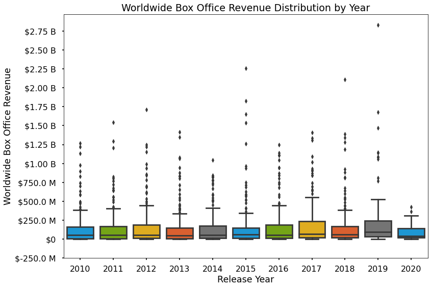

If we zoom in on the distributions without outliers, median revenues are fairly consistent year-over-year, hovering around $50 M most years.

50% of revenues over the past 10 years fall between $13.6 M and $177.2 M.
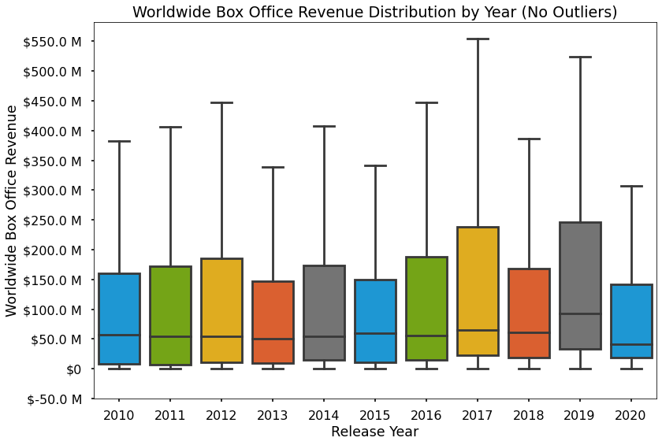

Similarly to revenue, profit distributions are also skewed to the right with many outliers in the upper ranges. Median is the most appropriate measure of central tendency.
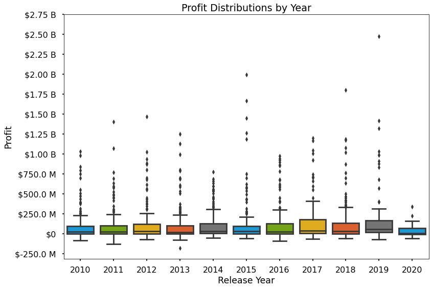

Median profits hover around around $27 M, with 50% of revenues falling in the range between -$452 K and $117.94 M
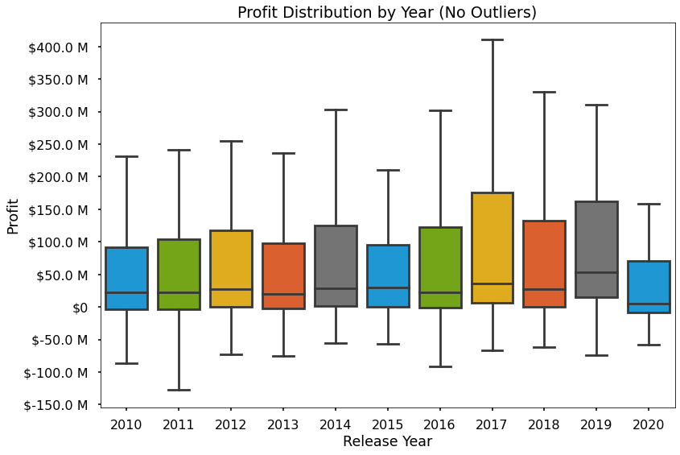

Box office revenues have remained fairly steady over the past 10 years, despite new studios releasing original content primarily online.

COVID-19 pandemic is likely a primary factor contributing to the dip in 2020, since theaters were closed in the US for most of the year. 

2020 also has a very high variability (tall error bar), so while median revenue was down overall, there were still some movies that made large amounts of revenue. This could be due to the way studios decided which movies to release (that were more likely to make high revenues) versus movies that were held back until after the pandemic or released online only. 
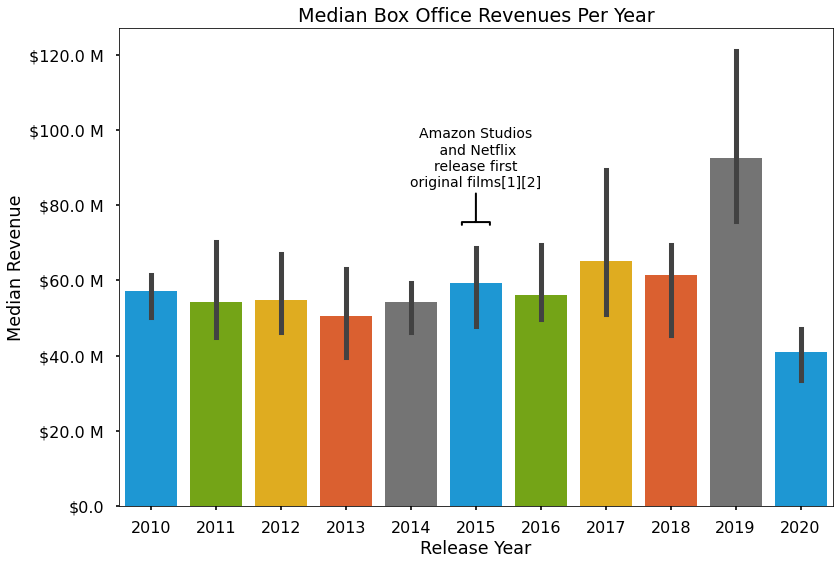

***
### Characteristice of Successful Movies

Animation, Adventure, Science Fiction, and Fantasy movies are the best genres to choose if Microsoft's primary goal is to maximize profits.
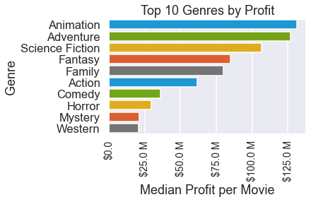

If the goal is to maximize ROI, Documentaries generate by far the highest, followed by Horror.
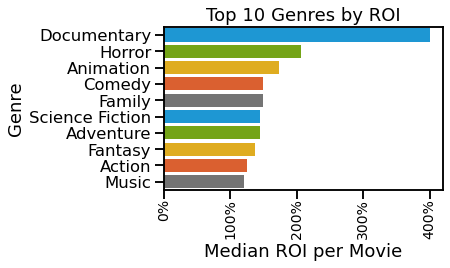

Movies with higher budgets generally make more profits.

- For a chance at the highest profits, Microsoft should make movies with higher budgets.

- The top 25% of budgets start at around $62.7 M, which is a reasonable floor for budgets to maximize profits.
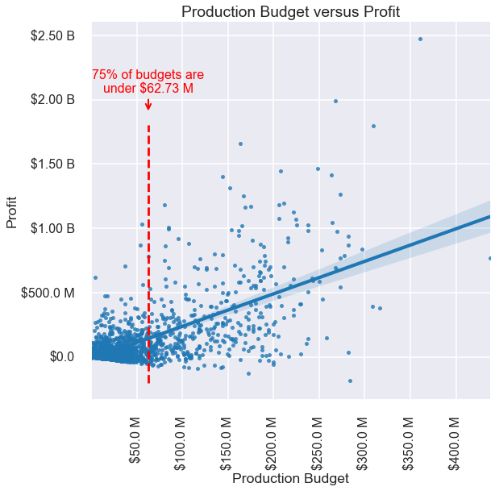

However, the inverse is true for ROI: movies with the lowest budgets make the highest ROI, and ROI decreases as budgets increase.

- To maximize ROI, Microsoft should make movies with lower budgets.

- The bottom 25% of budgets go up to around $10.9 M, which is a reasonable ceiling for budgets to maximize ROI.
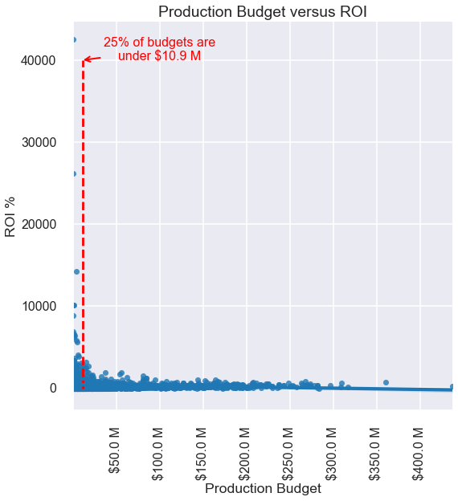

Movies released in December have the highest median profit by far. May, June, July, and November are also good choices for release months.

- Microsoft should avoid releasing movies in September, and also October, as they had the lowest media profits. 

- September and October also had the highest number of movies released, so the lower median profit in these months could be due to competition.
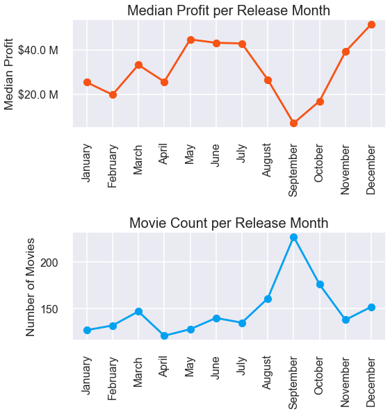

***
### Key contributors to Successful Movies

Key contributors to a movie such as Directors, Writers, Actors and Actresses can be important to its success.

While it's difficult to quantify the exact contribution an individual had to a movie's success, below are initial "short lists" of contributors Microsoft should consider hiring for its movies. 

These are individuals who worked on at least 2 movies in the past 10 years, and where movie averages were in the top 1% of profits, ROI, or audience ratings.

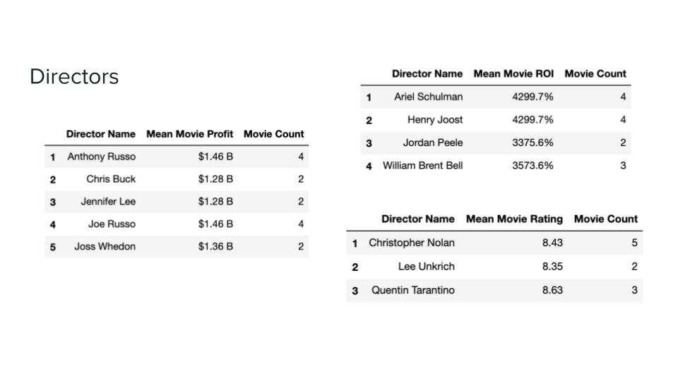
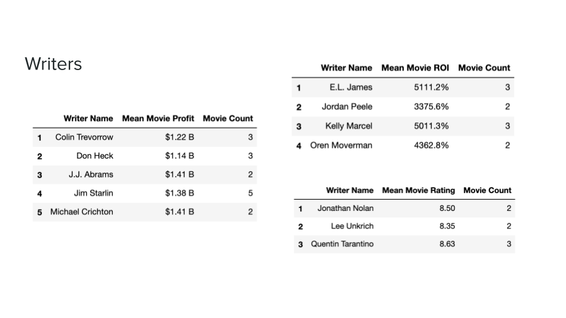
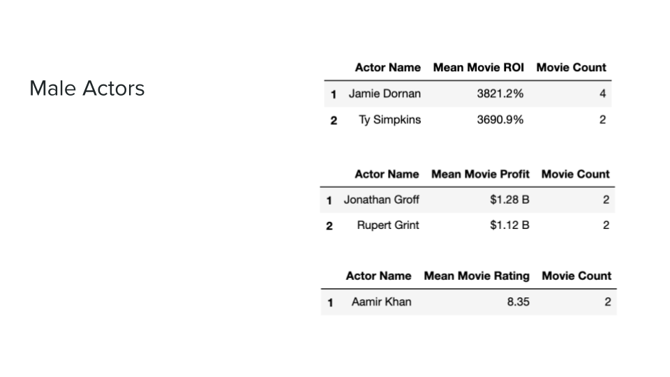
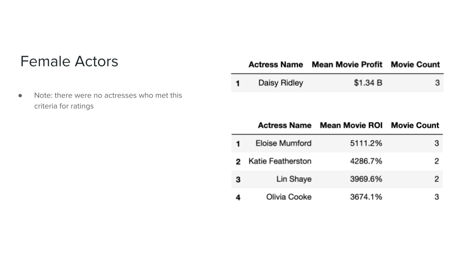
***

## Conclusions


Over the past ten years, movies typically made (in 2020 US dollars) $13.6 M to $177.2 M in box office revenue, and -$452 K to $117.94 M in profit.

However, it's still uncertain how the COVID-19 pandemic will affect box office revenues in the future. Past trends in box office revenue and profits may not pick up where they left off.

### Recommendations to maximize profits
- Focus on Adventure, Science Fiction, Animation, or Fantasy genres
- Make higher budget movies, over approximately $62.7M


### Recommendations to maximize ROI
- Focus on Documentaries, with Horror films as a distant second
- Make lower budget movies, under approximately $10.9M

### General Recommendations
- Target pre-holiday season (November, December), or early summer (May, June, July) to release movies to theaters
- Avoid releasing movies in September and October
- Consider hiring directors, writers, actors, and actresses who have contributed to movies with profit, ROI, and ratings in the top 1% of our sample

### Suggestions for further analysis
- If possible, obtain more financial data related to:
    - Average cut of box office proceeds that go to studios
    - Average spend on advertising and promotion
    - Average revenue post-theatrical-release (streaming, video-on-demand, etc)
- A closer look at factors contributing to high user ratings, critical ratings and award nominations
- Analysis of how runtime and MPAA ratings contribute to profit and ROI
- Investigate whether certain words or linguistic properties in titles contribute to higher profits or ROI

## For More Information

Please review my full analysis in [our Jupyter Notebook](./movie_analysis.ipynb) or my [presentation](./presentation.pdf).

For any additional questions, please contact **Jessica Miles, jess.c.miles@gmail.com**

## Repository Structure

Describe the structure of your repository and its contents, for example:

```
├── README.md              <- The top-level README for reviewers of this project
├── movie_analysis.ipynb   <- Narrative documentation of analysis in Jupyter notebook
├── presentation.pdf       <- PDF version of project presentation
├── data                   <- Both sourced externally and generated from code
├── data\zippedData        <- Files provided by Flatiron
└── images                 <- Generated from code
```
